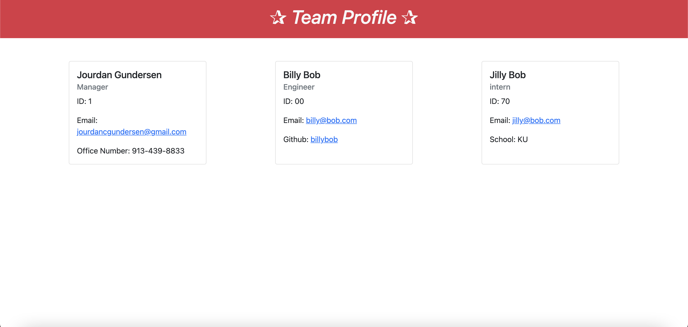

# team-profile-page-generator

### table-of-contents

- [description](#description)
- [installaion](#installation)
- [usage](#usage)
- [contribute](#contribute)
- [testing](#testing)
- [questions](#questions)

### description

this program is designed to create an html page based upon information inputted by the user regarding employees such as a manager, engineers, and interns.

### installation

to successfully run this program, the user will need to:

- do a git clone
- open index.js in the integrated terminal - right click on index.js in the menu and click run in integrated terminal
- run "npm init"
- run "npm i"

### usage

to run this program type "node index.js" in the integrated terminal

### contribute

the creator was the sole contributor, open to suggestions and constructive criticism!

### testing

this program was tested by the creator, Jourdan Gundersen, along with the test files in the repository

### questions

for additional questions, please contact Jourdan Gundersen on github at the following link: [jourdangundersen](https://github.com/jourdangundersen).

you may also contact me via email at jourdancgundersen@gmail.com

github repo: https://github.com/jourdangundersen/team-profile-page-generator

deployed link: [team-profile-page-generator](https://drive.google.com/file/d/1WkC9ZD5x8uCAK3HuRX2jFNZQ3qRE2LLL/view)

